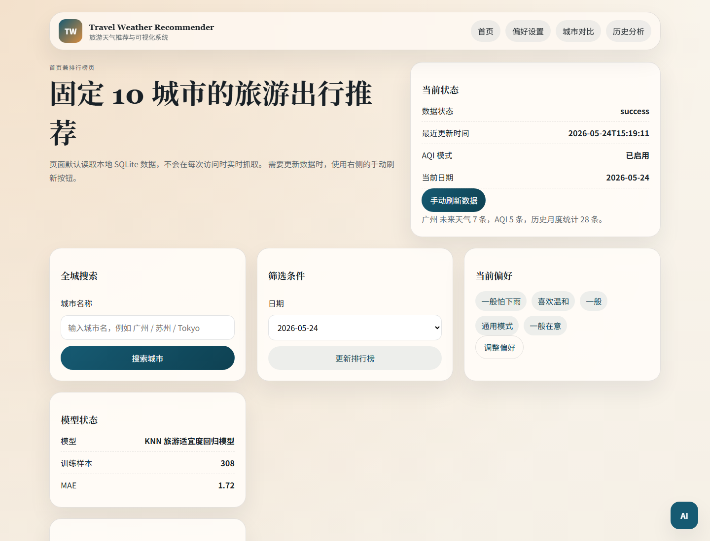
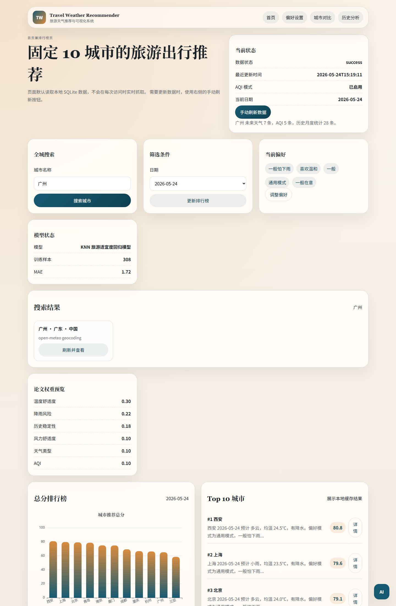
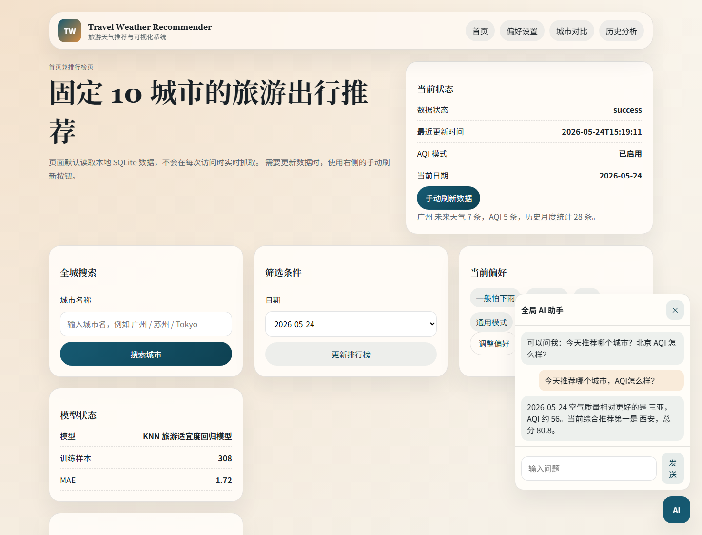
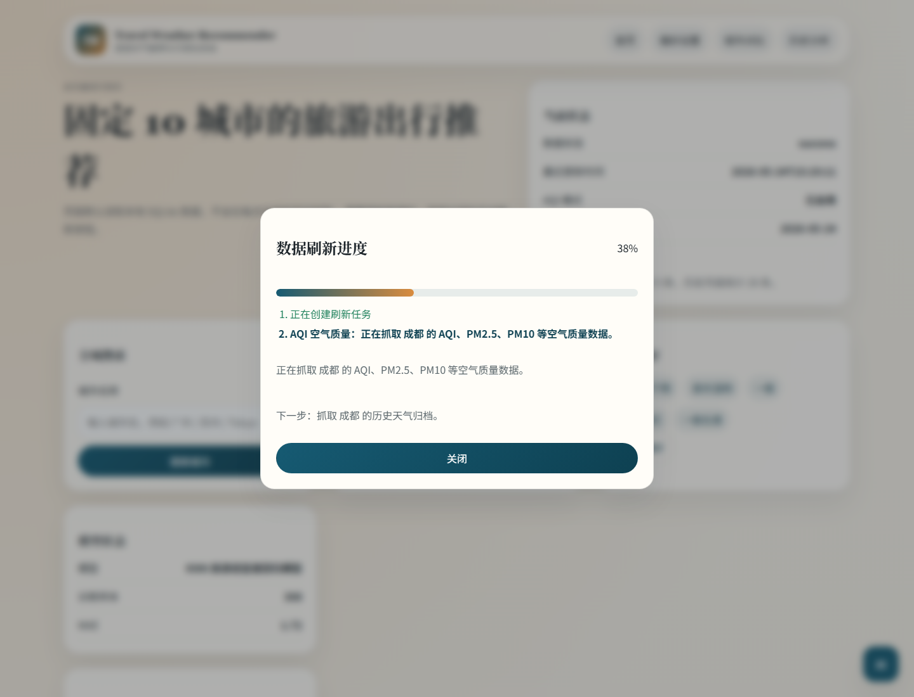

# 项目提升汇报材料：全城搜索、机器学习预测与 AI 助手

## 本阶段完成内容

1. 加入全城搜索
   - 使用免费 Open-Meteo Geocoding API 搜索城市。
   - 搜索结果支持单城市刷新，不需要每次全量刷新全部城市。
   - 动态搜索城市会写入本地 SQLite，刷新后可以进入城市详情页。

2. 加入机器学习预测模型
   - 新增 KNN 旅游适宜度回归模型。
   - 使用历史月度统计数据作为训练样本。
   - 页面同时展示规则分、机器学习预测分和综合分。
   - 综合分计算方式：`综合分 = 规则分 * 0.75 + ML预测分 * 0.25`。

3. 预留全局 AI 助手接口
   - 页面右下角新增全局 AI 助手。
   - 后端新增 `/api/assistant` 接口。
   - 当前版本基于本地 SQLite 数据回答推荐、AQI、城市分数等问题。
   - 后续可以在 `service/ai_assistant.py` 中接入真实大模型 API。

4. 加入实时刷新进度弹窗
   - 刷新数据时不再只依赖浏览器加载转圈。
   - 前端弹窗展示当前阶段、当前步骤、下一步计划和总体进度。
   - 后端使用后台线程执行刷新任务，前端通过 SSE 接收实时事件。

## 遇到的困难与解决方式

### 困难 1：原项目只支持固定 10 个城市

原来的城市都写在 `config/cities.py` 里，城市详情页也默认只能读取固定城市。如果直接搜索新城市，页面无法识别动态城市。

解决方式：

- 使用 Open-Meteo Geocoding API 根据城市名获取经纬度。
- 给搜索城市生成 `geo-城市ID` 格式的动态 `slug`。
- 数据刷新后从 SQLite 读取动态城市元信息，城市详情页不再只依赖固定配置。

### 困难 2：动态城市不能使用天气网页爬虫

原未来天气页面爬虫依赖 `tianqi.com/{pinyin}`，搜索城市不一定有可用拼音路径，容易失败。

解决方式：

- 固定城市全量刷新仍保留原有网页抓取 + API 补充。
- 搜索城市使用 Open-Meteo Forecast API、Air Quality API 和 Archive API。
- 单城市刷新只刷新目标城市，降低失败范围。

### 困难 3：机器学习不能引入过重依赖

项目当前依赖较少，如果强行加入 sklearn，会增加安装难度，也可能影响老师本地运行。

解决方式：

- 自己实现轻量 KNN 回归模型。
- 使用 pandas 处理训练样本，不新增第三方机器学习依赖。
- 模型可解释：用历史月份相似样本预测旅游适宜度。

### 困难 4：AI 助手不能直接依赖付费 API

老师要求保留 AI 能力，但项目需要优先保证免费、可运行。

解决方式：

- 先实现 `/api/assistant` 本地接口。
- 当前通过本地数据库和推荐结果生成回答。
- 预留 `TRAVEL_AI_ENDPOINT` 和 `TRAVEL_AI_API_KEY`，后续可以替换为真实大模型调用。

### 困难 5：刷新过程耗时长且用户不知道系统在做什么

原来的“手动刷新数据”是同步表单提交，用户只能看到浏览器转圈，无法知道系统正在抓取哪个城市、哪一类数据，也不知道后续还要做清洗、写库还是日志记录。

解决方式：

- 新增后台刷新任务队列。
- `refresh_all_data()` 支持进度回调，抓取每个城市的未来天气、AQI、历史天气时都会发出进度事件。
- 前端使用 `EventSource` 监听 `/refresh/events/<job_id>`，实时更新弹窗。
- 保留原 `/refresh` 同步路由作为兜底，浏览器不支持实时事件时仍可刷新。

## 截图展示

### 首页：全城搜索和机器学习模型状态

### 搜索结果：城市搜索与单城市刷新入口

### 全局 AI 助手：本地数据问答

### 实时刷新进度：显示当前步骤和下一步计划

## 汇报时可以这样说明

本阶段主要完成了四个增强方向：第一，系统从固定 10 城市扩展为支持全城搜索，用户可以搜索任意城市并单独刷新该城市天气数据；第二，系统加入机器学习预测模型，用历史月度统计数据训练 KNN 回归模型，预测城市旅游适宜度，并与原规则评分融合；第三，系统新增全局 AI 助手接口，当前基于本地数据回答用户问题，同时预留真实大模型 API 调用位置；第四，系统加入实时刷新进度弹窗，让用户能看到当前正在抓取什么数据、下一步是什么，而不是只能等待浏览器加载。
